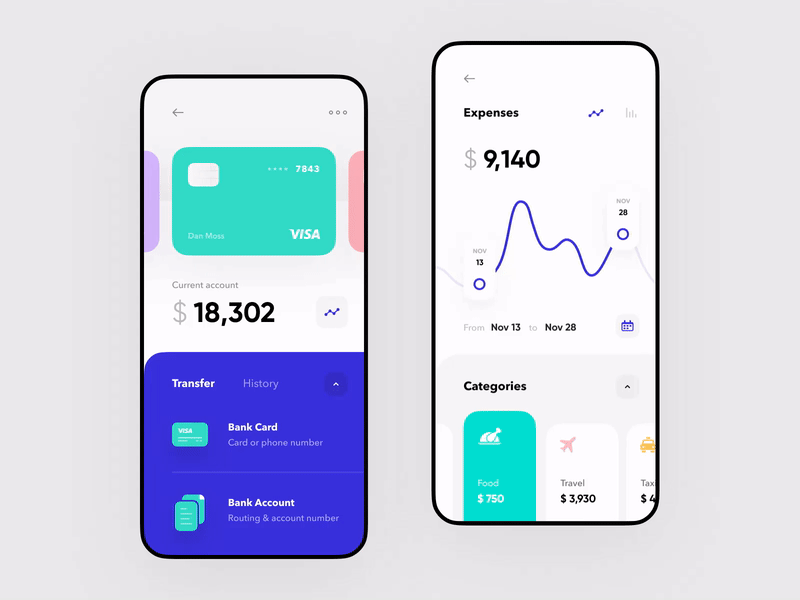
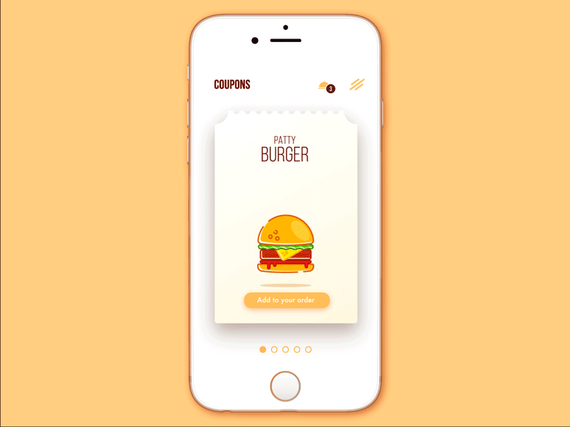
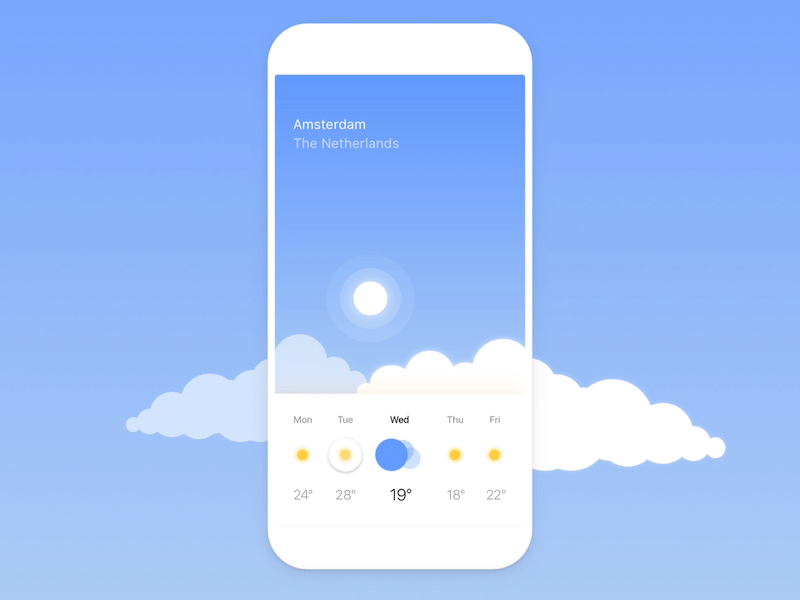
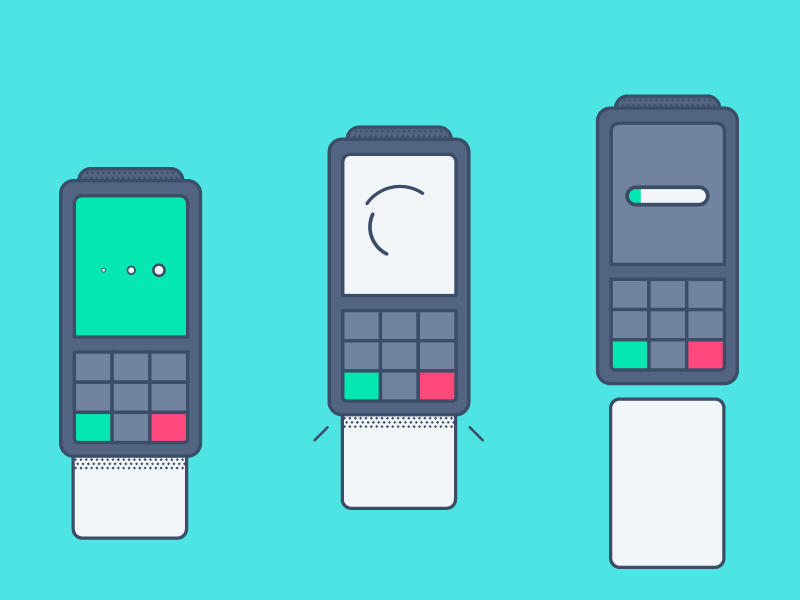
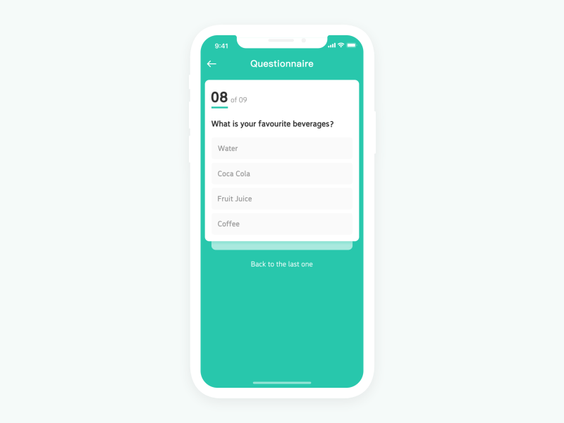

# mahadi18.github.io

<!DOCTYPE html>
<html lang="zxx" class="no-js">

<head>
	<!-- Mobile Specific Meta -->
	<meta name="viewport" content="width=device-width, initial-scale=1, shrink-to-fit=no">
	<!-- Favicon-->
	<link rel="shortcut icon" href="img/logo.png">
	<!-- Author Meta -->
	<meta name="author" content="colorlib">
	<!-- Meta Description -->
	<meta name="description" content="">
	<!-- Meta Keyword -->
	<meta name="keywords" content="">
	<!-- meta character set -->
	<meta charset="UTF-8">
	<!-- Site Title -->
	<title>ASM Al Zihadi</title>

	<link href="https://fonts.googleapis.com/css?family=Poppins:100,200,400,300,500,600,700" rel="stylesheet">
	<link href="https://fonts.googleapis.com/css?family=Roboto:300,400,500,600,700,900" rel="stylesheet">
	<!--
			CSS
			============================================= -->
	<link rel="stylesheet" href="css/linearicons.css">
	<link rel="stylesheet" href="css/font-awesome.min.css">
	<link rel="stylesheet" href="css/bootstrap.css">
	<link rel="stylesheet" href="css/magnific-popup.css">
	<link rel="stylesheet" href="css/nice-select.css">
	<link rel="stylesheet" href="css/animate.min.css">
	<link rel="stylesheet" href="css/owl.carousel.css">
	<link rel="stylesheet" href="css/main.css">
</head>

<body>

	<!-- Start Preloader Area -->
	

		

			

		

	

	<!-- End Preloader Area -->

	<!-- Start Header Area -->
	<header id="header">
		

			

				

					
				

				<nav id="nav-menu-container">
					<ul class="nav-menu">
						<li><a id="mHome" class="active" href="#">HOME</a></li>
						<li><a id="mAbout" href="#about-area">ABOUT ME</a></li>
						<li><a id="mWork" href="#work-area">PORTFOLIO</a></li>
						
						<li><a href="https://mahadis.wordpress.com/" target="_blank">BLOG</a>
						<li><a href="https://drive.google.com/file/d/12lEuolzKpi9PPOxSjyRRq4v17FZDFi7r/view" target="_blank">RESUME</a></li>
						<li><a id="mContact" href="#contact-area">CONTACT</a></li>
						<!-- <li class="menu-has-children"><a href="#">Pages</a>
							<ul>
								<li><a href="elements.html">Elements</a></li>
								<li><a href="contact.html">Contact</a></li>
								<li><a href="services.html">Service</a></li>
								<li><a href="portfolio-details.html">Portfolio Details</a></li>
							</ul>
						</li> -->
						
							<!-- <ul>
								<li><a href="blog-home.html">Blog Home</a></li>
								<li><a href="blog-single.html">Blog Single</a></li>
							</ul> -->
						</li>
					</ul>
				</nav>
			

		

	</header>
	<!-- End Header Area -->

	<!-- start banner Area -->
	<section class="home-banner-area" id="home"> <!-- style="background: url('img/banner-bg-o.jpg')" -->
		

			

				

					
Hi 👋 I'm 

					<h1 class="wow fadeInUp" data-wow-duration="1s" data-wow-delay="1.7s">ASM AL Zihadi</h1>
					

						Software Engineer, 
						Android
						<!-- and Content
						Developer -->
					

					<a href="mailto:asm.alzihadi@gmail.com" class="primary-btn" data-text="Tell me about your project">
						T
						e
						l
						l
						 
						 
						m
						e
						 
						 
						a
						b
						o
						u
						t
						 
						 
						y
						o
						u
						r
						 
						 
						p
						r
						o
						j
						e
						c
						t
					</a>
					 
					 
					 
				

				

					
				

			

		

	</section>
	<!-- End banner Area -->

	<!-- Start brands Area -->
	<!-- <section class="brands-area">
		

			

				

					

						
					

					

						
					

					

						
					

					

						
					

					

						
					

				

			

		

	</section> -->
	<!-- End brands Area -->

	<!-- Start About Area -->
	<section class="about-area section-gap" id="about">
		

			

				

					
				

				

					

						<h2>About Me</h2>
					

					

						<ul class="unordered-list">
							<li>
								Software Engineer with <b>4+ years</b> of industry experience.
							</li>
							<li>
								Build smooth, stable, and marvelous products with <b>Kotlin</b>/<b>Java</b> and <b>Flutter</b>.
							</li>
							<li>
								Expert at designing, developing, building and deploying complete system for <b>Native & Hybrid</b> App.
							</li>
							<li>
								Developed <b>10+ Mobile Applications</b> those reached over <b>1M users</b>.
							</li>
							<!-- <li>
								Evaluate technical feasibility on business requests, quality control & validate on implementation level of the solution
							</li> -->
							<!-- <li>
								Define and formalize the architecture design process with the team
							</li> -->
						</ul>
					

					<a href="https://www.linkedin.com/in/mahadi18/" target="_blank" class="primary-btn white" data-text="More Info">
						M
						o
						r
						e
						 
						I
						n
						f
						o
					</a>
					<a href="https://drive.google.com/file/d/12lEuolzKpi9PPOxSjyRRq4v17FZDFi7r/view" target="_blank" class="primary-btn" data-text="Resume">
						R
						e
						s
						u
						m
						e
					</a>
				

			

		

	</section>
	<!-- End About Area -->

	<!-- Start Work Area Area -->
	<section class="work-area section-gap-top section-gap-bottom-90" id="work">
		

			

				

					

						<h2>My Projects</h2>
						

					

				

				

					

						<ul>
							<li class="active" data-filter=".all">All Projects</li>
							<li data-filter=".branding">Android App</li>
							<li data-filter=".creative">Wireframing</li>
							<li data-filter=".web-design">Web Development</li>
						</ul>
					

				

			

			

				

					

						

							

								

								
							

							

								<h4>Hishab Nikash</h4>
								
Personal Finance Manager

							

							
						

					

					

						

							

								

								
							

							

								<h4>Foodie!</h4>
								
Local Food Delivery

							

							
						

					

					

						

							

								

								
							

							

								<h4>Blue Sky</h4>
								
Weather App

							

							
						

					

					

						

							

								

								
							

							

								<h4>Integrated POS app</h4>
								
Mobile POS app with insights

							

							
						

					

					

						

							

								

								
							

							

								<h4>Canvass</h4>
								
Survey builder app

							

							
						

					

					

						

							

								

								
							

							

								<h4>Amar Dokan</h4>
								
Business Tool For SME

							

							
						

					

				

			

		

	</section>
	<!-- End Work Area Area -->

	<!-- Start Job History Area Area -->
	<!-- <section class="job-area section-gap-top section-gap-bottom-90">
		

			

				

					

						<h2>Work History</h2>
						

					

				

			

			

				

					

						

							

								<h4>Software Engineer</h4>
								
Nascenia Ltd

							

							

								<a href="https://www.facebook.com/orchidtechstudio" target="_blank" class="primary-btn" data-text="Apr '21 to Present">
									Apr
									'21
									to
									Present
								</a>
							

						

						

							Leading software development company in Bangladesh. We have satisfied clients from Denmark, The Netherlands, USA, UK, Sweden, India, Nigeria and Canada.
						

					

				

				

					

						

							

								<h4>Software Engineer</h4>
								
Orchid Tech Studio

							

							

								<a href="https://www.facebook.com/orchidtechstudio" target="_blank" class="primary-btn" data-text="Sep '20 to Present">
									Sep
									'20
									to
									Present
								</a>
							

						

						

							We are very energetic young who want to innovate effective solution and implement them. Our dream is to provide solution that would make people's life easier and to reach the top level of tech industry.
						

					

				

				

					

						

							

								<h4>Software Engineer</h4>
								
pi STRATEGY Consulting Ltd

							

							

								<a href="https://www.facebook.com/pistrategy" target="_blank" class="primary-btn" data-text="Jul '19 to Sep '20">
									Jul
									'19
									to
									Present
								</a>
							

						

						

							pi Strategy Consulting is a leading management consulting firm. It specializes at the confluence of strategy and innovation.
						

					

				

				

					

						

							

								<h4>Jr. Software Engineer</h4>
								
Dnet - Social Enterprise

							

							

								<a href="https://www.facebook.com/dnetbd" target="_blank" class="primary-btn" data-text="Sep '17 to Jun '19">
									Sep
									'17
									to
									Jun
									'19
								</a>
							

						

						

							Dnet, a social enterprise with a vision to create an impact in the society with the power of information, technology and knowledge.
						

					

				

			

		

	</section>  -->
	<!-- End Job Historyt Area Area -->

	<!-- Start Service Area -->
	<section class="service-area section-gap" id="service">
		

			

				

					

						<h2>Service Offers</h2>
						

					

				

			

			

				

					

						
						<h4>Consulting</h4>
						
Get consultation about your product to make it business standard with technical details. 

					

				

				

					

						
						<h4>Wireframing 
						</h4>
						
Get wireframe and prototype of your product.

					

				

				

					

						
						<h4>Android App Development</h4>
						
Get android app with great UI and UX as well as high performance.

					

				

				

					

						
						<h4>Backend Development
						</h4>
						
Get scalable backend for you large scale business.

					

				

			

		

	</section>
	<!-- End Service Area -->

	<!-- Start Testimonials Area -->
	<!-- <section class="testimonials_area section-gap">
		

			

				

					

						
						<h4>Fanny Spencer</h4>
						<ul class="list">
							<li><a href="#"><i class="fa fa-star"></i></a></li>
							<li><a href="#"><i class="fa fa-star"></i></a></li>
							<li><a href="#"><i class="fa fa-star"></i></a></li>
							<li><a href="#"><i class="fa fa-star"></i></a></li>
							<li><a href="#"><i class="fa fa-star"></i></a></li>
						</ul>
						

							

								As conscious traveling Paup ers we must always be oncerned about our dear Mother Earth. If you think about it, you travel
								across her face   and She is the host to your journey.
							

						

					

				

				

					

						
						<h4>Fanny Spencer</h4>
						<ul class="list">
							<li><a href="#"><i class="fa fa-star"></i></a></li>
							<li><a href="#"><i class="fa fa-star"></i></a></li>
							<li><a href="#"><i class="fa fa-star"></i></a></li>
							<li><a href="#"><i class="fa fa-star"></i></a></li>
							<li><a href="#"><i class="fa fa-star"></i></a></li>
						</ul>
						

							

								As conscious traveling Paup ers we must always be oncerned about our dear Mother Earth. If you think about it, you travel
								across her face   and She is the host to your journey.
							

						

					

				

				

					

						
						<h4>Fanny Spencer</h4>
						<ul class="list">
							<li><a href="#"><i class="fa fa-star"></i></a></li>
							<li><a href="#"><i class="fa fa-star"></i></a></li>
							<li><a href="#"><i class="fa fa-star"></i></a></li>
							<li><a href="#"><i class="fa fa-star"></i></a></li>
							<li><a href="#"><i class="fa fa-star"></i></a></li>
						</ul>
						

							

								As conscious traveling Paup ers we must always be oncerned about our dear Mother Earth. If you think about it, you travel
								across her face   and She is the host to your journey.
							

						

					

				

			

		

	</section> -->
	<!-- End Testimonials Area -->

	<!-- Start Contact Area -->
	<section class="contact-area section-gap" id="contact-info">
		

			

				

					

						<h2>Contact Me</h2>
						
Feel free to reach me

					

				

			

			

				

					

						<h4>+880-1892-256-338</h4>
					

				

				

					

						<h4>asm.alzihadi@gmail.com</h4>
					

				

				

					

						<h4>m.me/mahadi.06</h4>
					

				

			

			

				

					<a href="mailto:asm.alzihadi@gmail.com" class="primary-btn mt-50" data-text="Hire Me">
						H
						i
						r
						e
						 
						M
						e
					</a>
				

			

		

	</section>
	<!-- End Contact Area -->

	<!-- start footer Area -->
	<footer class="footer-area">
		

			

				

					

						

							
							<h4>Follow Me</h4>
						

						

							<a href="https://www.facebook.com/mahadi.06" target="_blank"><i class="fa fa-facebook"></i></a>
							<a href="https://twitter.com/m_a_hadi_" target="_blank"><i class="fa fa-twitter"></i></a>
							<a href="https://www.github.com/mahadi18" target="_blank"><i class="fa fa-github"></i></a>
							<a href="https://www.linkedin.com/in/mahadi18" target="_blank"><i class="fa fa-linkedin"></i></a>
						

					

				

			

			

				

					<!-- Link back to Colorlib can't be removed. Template is licensed under CC BY 3.0. -->
Copyright &copy; All rights reserved 
<!-- | This template is made with <i class="fa fa-heart-o" aria-hidden="true"></i> by <a href="https://colorlib.com" target="_blank">Colorlib</a> -->
<!-- Link back to Colorlib can't be removed. Template is licensed under CC BY 3.0. -->

			

			<!-- 

			 	<a href='https://www.stat-counter.org/'>www.Stat-Counter.org</a> 
				
			
 -->
		

	</footer>
	<!-- End footer Area -->

	<!-- ####################### Start Scroll to Top Area ####################### -->
	

		<a id="goTop" title="Go to Top" href="#">
			<i class="lnr lnr-arrow-up"></i>
		</a>
	

	<!-- ####################### End Scroll to Top Area ####################### -->

	
	
	
	
	
	
	
	
	
	
	
	
	
	
	
	
	
	
</body>

</html>
